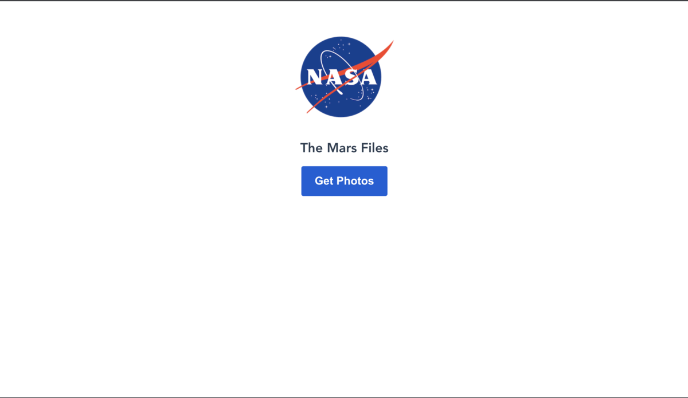

# The Mars Gallery Page

## Description

Mars pictures viewer made by rovers [NASA API](https://api.nasa.gov/)

 </img>

## Quick start (development mode)

To start the project you need Node and Yarn

```bash
yarn install
yarn serve
```

## Tech stack

- [Vue](https://vuejs.org/)
- [Axios](https://github.com/axios/axios)

## Project structure

```bash
├── public              # index.html
├── src                 # Sources
│   ├── components      # Reusable components
│   ├── assets          # Images
├── yarn.lock           # Dependencies and nested dependencies tree
```

© Vadim Frolov, 2021
